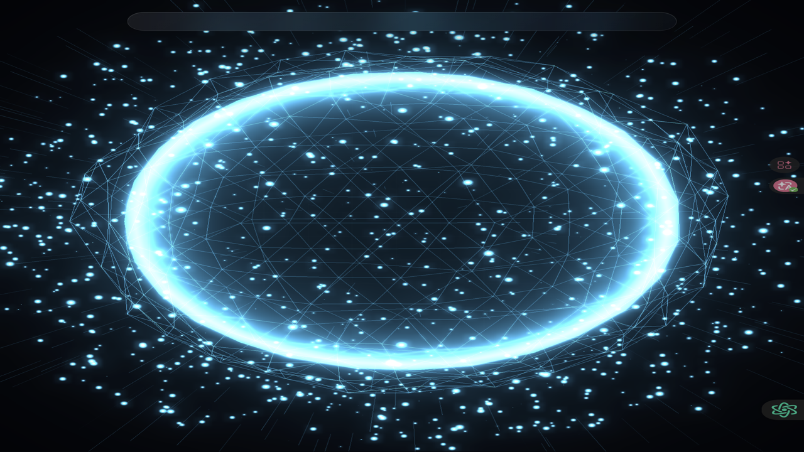

# 链上生命 · Chain Life

> 任意钱包地址 → 一个活的"链上生命体"。基于 Arbitrum One 真实链上数据的 3D 呼吸球可视化。
> Any wallet address → a living on-chain organism. A 3D breathing orb driven by **real Arbitrum One chain data**.

**在线体验 / Live demo:** https://montreefork.github.io/chain-life/



---

## ✨ 核心概念

每个钱包都是一条生命。Chain Life 读取钱包在 Arbitrum One 上的真实余额与交易数，计算出**链上能量**（财富即岁月：`能量 = 余额 × 400 + 交易数`），驱动生命体经历 9 个阶段：

`Primordial → Emerged → Awakening → Growing → Thriving → Mature → Intense → Radiant → Ancient`

颜色从冰蓝到翠绿、金黄、橙红、品红——**活跃度和财富越高，生命越绚烂**。钱包从未活动过？它会诚实地呈现为一颗沉睡的蓝色原初之卵。

## 🎨 功能

- **9 阶段生命周期** — 由真实链上能量驱动，出生动画 + 阶段演化
- **13 种钱包原型** — 活跃度 × 财富 × 身份三维分类（巨鲸 / 机构金库 / 囤币大户 / 冷合约 / 万物坟墓…），每类专属图标与强调色，附组合标签（空投猎人 / 鲸群核心）
- **实时链上数据** — 三层回退：直连官方 RPC（CORS）→ 本地代理 → 模拟模式
- **呼吸互动** — 点击球体激发一次光脉冲；Bloom 呼吸光效 + 色彩分级后处理
- **NFT 铸造** — 全链上 ERC-721：SVG 呼吸动画 + 元数据 data URI，一钱包一枚
- **钱包画像** — 生命力进度条、9 阶段点阵、药丸标签、数据来源徽章

## 🔗 智能合约（Arbitrum Sepolia）

| | |
|---|---|
| 合约 | `ChainLifeNFT` |
| 地址 | `0x8ECEea508F628aA346a10F300218FBaAc9E7b1Ee` |
| 机制 | `tokenId = keccak256(钱包地址)`，每个钱包仅能铸造一枚 |
| 艺术 | 100% 链上生成（SVG + SMIL 呼吸动画，呼吸速度由生命力决定） |
| 元数据 | data URI JSON（阶段 / 能量 / 生命力 / 交易数） |

部署与验证脚本见 [`contract/`](contract/)，测试 NFT 示例见 [`contract/test-nft.svg`](contract/test-nft.svg)。

## 🏗️ 技术栈

- **Three.js 0.160** — 自定义 ShaderMaterial（壳/核心/粒子/尾迹）、UnrealBloomPass、EffectComposer
- **8 位渲染管线 + 色彩分级 Pass** — 规避 macOS Chrome 半浮点黑块伪影并找回 HDR 质感
- **Arbitrum One RPC** — `eth_getBalance` / `eth_getTransactionCount` / `eth_getCode`
- **Solidity + OpenZeppelin ERC-721** — 全链上 NFT
- **ethers v6** — 前端铸造集成

## 🚀 本地运行

```bash
cd chain-life-v2
node server.js        # http://127.0.0.1:8787（提供 /rpc 代理与静态托管）
```

直连官方 RPC 失败时会自动回退到本地 `/rpc` 代理；两者都不可用时进入模拟模式。

## 🎬 铸造 NFT

1. 生成你的生命体
2. 点击「铸造 NFT」→ MetaMask 切换到 Arbitrum Sepolia
3. 确认交易 → 一钱包一枚，不可重复铸造

测试币：[Arbitrum Sepolia Faucet](https://faucets.chain.link/arbitrum-sepolia)

## 📁 目录

```
index.html          # 前端单文件应用（Three.js + 全部 UI）
server.js           # 本地静态服务器 + /rpc 代理
contract/
  ChainLifeNFT.sol  # 全链上 NFT 合约
  deploy.js         # 编译 + 部署（solc-js + ethers）
  test-mint.js      # 冒烟测试（铸造 + 验证 tokenURI）
  deployed.json     # 已部署地址与 ABI
```

## 🗺️ Roadmap

- [x] 真实链上数据驱动（Arbitrum One）
- [x] 9 阶段生命周期 + 13 原型评估系统
- [x] 全链上 NFT（Arbitrum Sepolia）
- [ ] 真实 ERC-20 资产环（持仓卫星）
- [ ] 链上钱包年龄（首笔交易二分查找）
- [ ] 协议交互识别（Uniswap / Aave / GMX…）
- [ ] 原型形态差异化（巨鲸 / 晶体合约 / 远古多环）
- [ ] MetaMask 一键连接 + 历史记录

---

**Chain Life** — 让冷冰冰的地址，变成可感知的生命形态。
Built for **Arbitrum Open House Singapore: Online Buildathon** 🏗️
